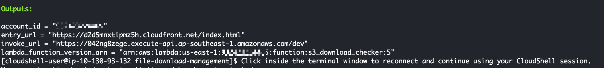
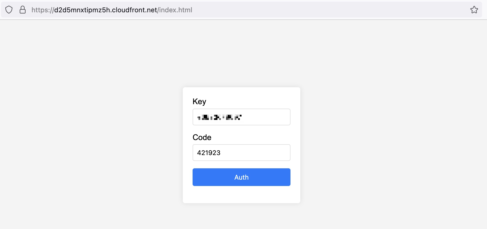
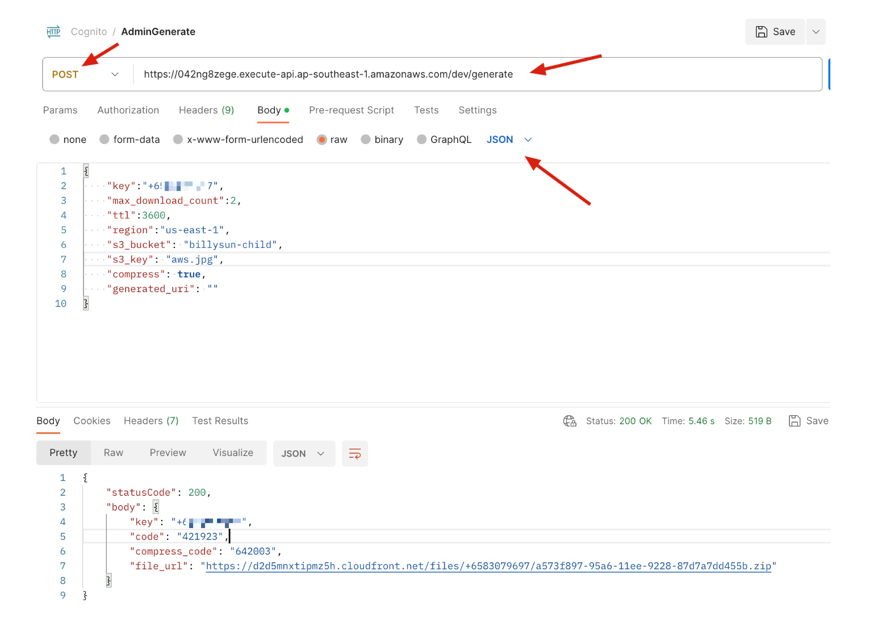

# AWS File Download Management example
Terraform is an infrastructure-as-code (IaC) tool that helps you create, update, and version your infrastructure in a secure and repeatable manner.

The scope of this pattern is to provide a guide and ready to use terraform configurations to setup the file download management tools with end-to-end tests based on AWS Cognito, AWS S3, AWS Lambda, AWS Lambda@Edge, AWS CloudFront and Terraform. 

The created file download management tools uses the best practices for infrastructure validation and has the below stages

- validate - This stage focuses on terraform IaC validation tools and commands such as terraform validate, terraform format, tfsec, tflint and checkov
- plan - This stage creates an execution plan, which lets you preview the changes that Terraform plans to make to your infrastructure.
- apply - This stage uses the plan created above to provision the infrastructure in the test account.
- destroy - This stage destroys the infrastructure created in the above stage.
Running these four stages ensures the integrity of the terraform configurations.

## Directory Structure
```shell
.
├── examples
│   └── terraform.tfvars
├── html
│   └── index.html
├── lambda_source
│   ├── pre_auth_lambda
│   │   └── lambda_function.py
│   ├── pre_signup_lambda
│   │   └── lambda_function.py
│   ├── s3_download_checker
│   │   ├── index.js
│   │   ├── node_modules
│   │   └── package.json
│   ├── s3_download_management_api_generate_lambda
│   │   ├── lambda_function.py
│   │   ├── pyminizip-0.2.6.dist-info
│   │   └── pyminizip.cpython-310-x86_64-linux-gnu.so
│   ├── s3_download_management_api_verify_lambda
│   │   └── lambda_function.py
│   └── template
│       └── s3_download_checker
│           └── index.js
├── main.tf
├── modify_index.sh
├── modify_lambda_edge.sh
└── README.md

```
## Installation

#### Step 1: Clone this repository.

```shell
git@github.com:sunchaoqun/file-download-management.git
```
Note: If you don't have git installed, [install git](https://git-scm.com/book/en/v2/Getting-Started-Installing-Git).


#### Step 2: Update the variables in `examples/terraform.tfvars` based on your requirements. Make sure your region, file_download_bucket_name, global_salt, and aws_cognito_user_pool_name are suitable.

- Make sure that the bucket name exists

#### Step 3: Update remote backend configuration as required

#### Step 4: Configure the AWS Command Line Interface (AWS CLI) where this IaC is being executed. For more information, see [Configuring the AWS CLI](https://docs.aws.amazon.com/cli/latest/userguide/cli-chap-configure.html).

#### Step 5: Initialize the directory. Run terraform init

#### Step 6: Start a Terraform run using the command terraform apply

Note: Sample terraform.tfvars are available in the examples directory. You may use the below command if you need to provide this sample tfvars as an input to the apply command.
```shell
terraform apply -var-file=./examples/terraform.tfvars
```



account_id = "YOUR ACCOUNT ID"

entry_url = "https://d2d5mnxtipmz5h.cloudfront.net/index.html"

* You can directly vist your entry 



invoke_url = "https://042ng8zege.execute-api.ap-southeast-1.amazonaws.com/dev"

* You can try to assign a file to the user

```json

{
    "key":"+65XXXXXXXX",
    "max_download_count":2,
    "ttl":3600,
    "region":"us-east-1",
    "s3_bucket": "billysun-child",
    "s3_key": "aws.jpg",
    "compress": true,
    "generated_uri": ""
}

```



<b>key</b>: you want to assign to Phone(+CountryCodeXXXXXXXX ) or Email(x@xx.com), will send OTP to what you specified

<b>max_download_count</b>: How many times the user can download

<b>ttl</b>: when the user first time to login, if they don't download then 3600 seconds it will expired.

<b>region</b>: which region your file locate

<b>s3_bucket</b>: which bucket your file locate

<b>s3_key</b>: the file name which you want them to download

<b>compress</b>: compress the file or not, if conpress the file, the compress could will show

<b>generated_uri</b>: specify the concrete file name, If you don't want to random file name

The result:

```json
{
    "statusCode": 200,
    "body": {
        "key": "+65XXXXX",
        "code": "421923",
        "compress_code": "642003",
        "file_url": "https://d2d5mnxtipmz5h.cloudfront.net/files/+6583079697/a573f897-95a6-11ee-9228-87d7a7dd455b.zip"
    }
}
```
<b>key</b>: return the key your entered

<b>code</b>: login code

<b>compress_code</b>: the compress code the user can compress


lambda_function_version_arn = "arn:aws:lambda:us-east-1:932423224465:function:s3_download_checker:5"
* Only show the current version of the lambda@edge version

<!-- BEGIN_TF_DOCS -->
## Requirements

| Name | Version   |
|------|-----------|
| <a name="requirement_terraform"></a> [terraform](#requirement\_terraform) | \>= 1.0.0 |


## Providers

| Name | Version    |
|------|------------|
| <a name="provider_aws"></a> [aws](#provider\_aws) | \>= 4.20.1 |

## Modules

| Name | Source | Version |
|------|--------|---------|
| <a name="pre_auth_lambda"></a> [pre_auth_lambda](#lambda_source\pre_auth_lambda) | ./lambda_source/pre_auth_lambda | n/a |
| <a name="pre_signup_lambda"></a> [pre_signup_lambda](#lambda_source\pre_signup_lambda) | ./lambda_source/pre_signup_lambda | n/a |
| <a name="s3_download_checker"></a> [s3_download_checker](#lambda_source\s3_download_checker) | ./lambda_source/s3_download_checker | n/a |
| <a name="s3_download_management_api_generate_lambda"></a> [s3_download_management_api_generate_lambda](#lambda_source/s3_download_management_api_generate_lambda) | ./lambda_source/s3_download_management_api_generate_lambda | n/a |
| <a name="s3_download_management_api_verify_lambda"></a> [s3_download_management_api_verify_lambda](#lambda_source/s3_download_management_api_verify_lambda) | ./lambda_source/s3_download_management_api_verify_lambda | n/a |
| <a name="entry_html"></a> [entry_html](#html/index.html) | ./html | n/a |

## Resources

| Name | Type |
|------|------|
| [aws_caller_identity.current](https://registry.terraform.io/providers/hashicorp/aws/latest/docs/data-sources/caller_identity) | data source |
| [aws_region.current](https://registry.terraform.io/providers/hashicorp/aws/latest/docs/data-sources/region) | data source |

## Inputs

| Name | Description | Type | Default | Required |
|------|-------------|------|---------|:--------:|
| <a name="region"></a> [region](#example/terraform.tfvars) | Specify which region you will deploy this solution | `string` | `"ap-southeast-1"` | yes |
| <a name="file_download_bucket_name"></a> [file_download_bucket_name](#example/terraform.tfvars) | All the downloaded files will be stored in this bucket | `string` | "file-download-bucket-billysun" | yes |
| <a name="global_salt"></a> [global_salt](#example/terraform.tfvars) | The underlying implementation using Cognito, Using this SALT to provide more security way | `string` | `"Aws1234."` | yes |
| <a name="cognito_user_pool_name"></a> [cognito_user_pool_name](#example/terraform.tfvars) | Specify your Cognito User Pool name | `string` | `"file_download_management_pool"` | yes |

## Outputs

| Name | Description |
|------|-------------|
| <a name="account_id"></a> [account_id](#main.tf) | Show the current Account Id |
| <a name="entry_url"></a> [entry_url](#main.tf) | Entry of the login URL |
| <a name="invoke_url"></a> [invoke_url](#main.tf) | Management endpoint suggests to secure the "generate" POST method |
| <a name="lambda_function_version_arn"></a> [lambda_function_version_arn](#main.tf) | Print the lambda@edge for orgin request |

<!-- END_TF_DOCS -->

## Security

Because this solution is to copy the S3 file into the created bucket and restrict it to the public, you need to set suitable S3 permission to the lambda function to make it executable. Also, you can only restrict it to the specified S3 bucket permission.

## License

This library is licensed under the MIT-0 License. See the LICENSE file.

